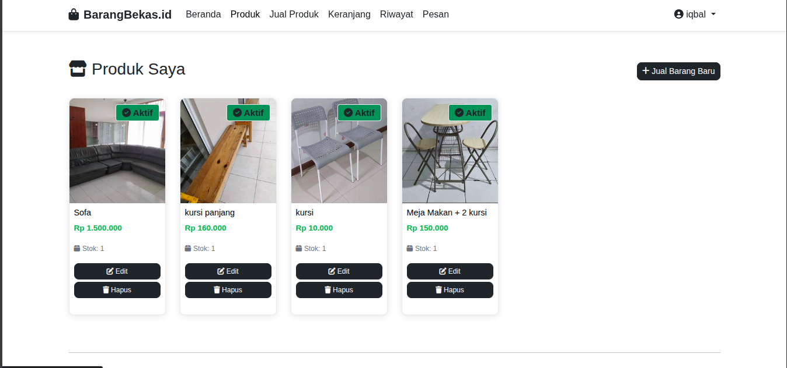

# 📸 Screenshots Directory

Folder ini digunakan untuk menyimpan semua screenshot aplikasi BarangBekas.id

## 📁 Struktur Folder

```
screenshots/
├── 01-authentication/          # Login, Register, Forgot Password
├── 02-homepage-marketplace/    # Homepage, Marketplace, Product Detail
├── 03-user-dashboard/          # My Products, Sell Form, Edit Product
├── 04-shopping-checkout/       # Cart, Checkout, Payment
├── 05-order-management/        # Order History, Order Detail
├── 06-communication/           # Messages, Chat
└── 07-profile-settings/        # Profile, Edit Profile, Settings
```

## ✅ Checklist Screenshot

### 01-authentication/
- [ ] `login.png` - Halaman Login
- [ ] `register.png` - Halaman Register
- [ ] `forgot-password.png` - Halaman Lupa Password

### 02-homepage-marketplace/
- [ ] `homepage.png` - Homepage (Banner + Produk)
- [ ] `marketplace.png` - Katalog Produk dengan Filter
- [ ] `product-detail.png` - Detail Produk dengan Carousel Foto

### 03-user-dashboard/
- [ ] `my-products.png` - Produk Saya (dengan Edit/Delete)
- [ ] `sell-form.png` - Form Jual Barang (Upload Multiple Images)
- [ ] `edit-product.png` - Edit Produk

### 04-shopping-checkout/
- [ ] `cart.png` - Keranjang Belanja
- [ ] `checkout.png` - Halaman Checkout
- [ ] `payment.png` - Halaman Pembayaran (Midtrans Snap Popup)

### 05-order-management/
- [ ] `orders.png` - Riwayat Pesanan
- [ ] `order-detail.png` - Detail Pesanan
- [ ] `order-tracking.png` - Tracking Status Order

### 06-communication/
- [ ] `messages-list.png` - Daftar Pesan
- [ ] `chat-window.png` - Jendela Chat
- [ ] `unread-notification.png` - Notifikasi Pesan Belum Dibaca

### 07-profile-settings/
- [ ] `profile.png` - Profil User
- [ ] `edit-profile.png` - Edit Profil
- [ ] `change-password.png` - Ubah Password

## 🛠️ Tools Screenshot yang Direkomendasikan

### Browser Extensions
- **GoFullPage** (Chrome) - Full page screenshot
- **Fireshot** - Screenshot dengan annotation
- **Nimbus Screenshot** - Capture & edit

### Desktop Applications
- **Lightshot** - Quick screenshot (prnt.sc)
- **Greenshot** - Open source dengan annotation
- **ShareX** (Windows) - Advanced screenshot tool
- **Flameshot** (Linux) - Screenshot dengan editor

### Browser DevTools
- Tekan **F12** → **Ctrl+Shift+P** (Chrome)
- Ketik "screenshot"
- Pilih **Capture full size screenshot**

## 📏 Ukuran Screenshot

- **Desktop**: 1920x1080 atau 1366x768
- **Tablet**: 768x1024 (gunakan DevTools responsive mode)
- **Mobile**: 375x667 atau 414x896 (responsive mode)

## 💾 Format File

- Gunakan **PNG** untuk kualitas terbaik
- Nama file menggunakan **lowercase** dengan **dash separator**
- Contoh: `product-detail.png`, `sell-form.png`

## 📝 Tips

1. **Bersihkan browser** - Hapus bookmark bar untuk screenshot lebih clean
2. **Incognito mode** - Gunakan untuk tampilan tanpa extension
3. **Consistent sizing** - Gunakan ukuran browser yang sama untuk semua screenshot
4. **Highlight fitur** - Gunakan annotation (arrow, box) untuk highlight fitur penting
5. **Before upload** - Compress gambar dengan TinyPNG atau Squoosh

## 🔗 Update README

Setelah screenshot selesai, update bagian ini di README.md:

```markdown
## 📸 Screenshot & Fitur

### 1. Homepage / Beranda


### 2. Marketplace


... dan seterusnya
```
